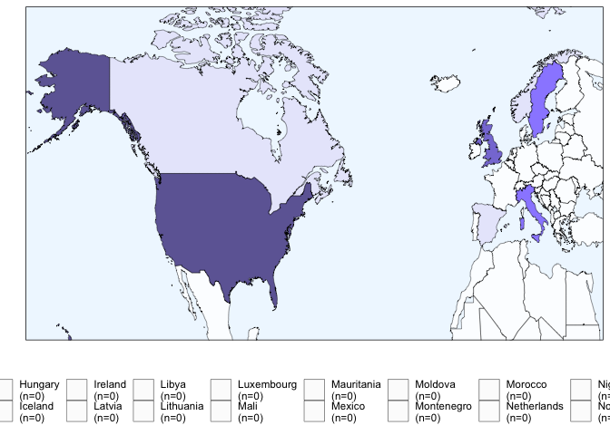

Visuals
================
Last updated: February 13, 2023

## Required Packages

``` r
library(ggplot2)
library(ggsignif)
library(DiagrammeR)
```

## Loading in the Dataset

The dataset used for this project can be found in this project’s
repository under the `data` folder as `sr-dataset.cv`. It can be
imported into your environment using the following code chunk:

``` r
 sr.dataset <- read.csv("~/github/university-meat-reduction/data/sr-dataset.csv")

print(sr.dataset)
```

    ##                                    study.title  country year.cond
    ## 1                  Andersson & Nelander (2021)   Sweden      2019
    ## 2                        Brunner et al. (2018)   Sweden      2016
    ## 3                        Campbell-Arvai (2011)      USA      2010
    ## 4                        Carfora et al. (2019)    Italy      2018
    ## 5              Carfora, Caso, & Conner (2017a)    Italy      2016
    ## 6              Carfora, Caso, & Conner (2017b)    Italy      2015
    ## 7        Cerezo-Prieto & Frutos-Esteban (2021)    Spain      2020
    ## 8                      Dissen & Crowell (2020)      USA      2019
    ## 9                        Garnett et al. (2021)  England      2018
    ## 10                      Garnett et al. (2020a)  England      2017
    ## 11                      Garnett et al. (2020b)  England      2018
    ## 12                       Garnett et al. (2019)  England      2017
    ## 13                        Hormes et al. (2013)      USA      2007
    ## 14          Jalil, Tasoff, & Bustamante (2020)      USA      2019
    ## 15                           Jay et al. (2019)      USA      2017
    ## 16                                 Kurz (2018)   Sweden      2015
    ## 17                        Larner et al. (2021)  England      2019
    ## 18                                Malan (2020)      USA      2019
    ## 19                         Malan et al. (2020)      USA      2018
    ## 20           McClain, Hekler, & Gardner (2013)      USA      2011
    ## 21                            McDonough (2012)   Canada      2010
    ## 22                       Michels et al. (2008)      USA      2001
    ## 23                                 Nash (2014)      USA      2013
    ## 24                     Papadaki & Scott (2005) Scotland      2003
    ## 25                      Piester et al. (2020a)      USA      2019
    ## 26                      Piester et al. (2020b)      USA      2019
    ## 27                          Ring et al. (2019)      USA      2017
    ## 28      Schwitzgebel, Cokelet, & Singer (2020)      USA      2017
    ## 29                     Slapø & Karevold (2019)   Norway      2018
    ## 30                      Turnwald & Crum (2019)      USA      2017
    ## 31 Wolstenholme, Poortinga, & Whitmarsh (2020)    Wales      2020
    ##         eval.method             approach           outcome.var effect.dir
    ## 1  Between-Subjects           Multimodal      Observed Changes          ^
    ## 2          Pre-Post           Multimodal      Observed Changes          ^
    ## 3  Between-Subjects           Multimodal      Intended Changes          ^
    ## 4              Both Conscious Processing Self-Reported Changes          ^
    ## 5              Both Conscious Processing Self-Reported Changes          ^
    ## 6              Both Conscious Processing Self-Reported Changes          ^
    ## 7          Pre-Post           Multimodal      Observed Changes          ^
    ## 8              Both Conscious Processing Self-Reported Changes          ^
    ## 9  Between-Subjects  Choice Architecture      Observed Changes        <> 
    ## 10 Between-Subjects  Choice Architecture      Observed Changes        <> 
    ## 11 Between-Subjects  Choice Architecture      Observed Changes          ^
    ## 12         Pre-Post Conscious Processing      Observed Changes          ^
    ## 13 Between-Subjects Conscious Processing      Intended Changes          ^
    ## 14             Both Conscious Processing      Observed Changes        <> 
    ## 15             Both Conscious Processing Self-Reported Changes        <> 
    ## 16             Both  Choice Architecture      Observed Changes        <> 
    ## 17         Pre-Post           Multimodal      Observed Changes          ^
    ## 18             Both           Multimodal      Observed Changes          ^
    ## 19             Both Conscious Processing Self-Reported Changes        <> 
    ## 20             Both           Multimodal Self-Reported Changes          ^
    ## 21         Pre-Post Conscious Processing      Intended Changes        <> 
    ## 22         Pre-Post Conscious Processing      Observed Changes          ^
    ## 23             Both Conscious Processing      Intended Changes        <> 
    ## 24             Both Conscious Processing Self-Reported Changes        <> 
    ## 25 Between-Subjects           Multimodal      Observed Changes          ^
    ## 26 Between-Subjects           Multimodal      Observed Changes          ^
    ## 27             Both Conscious Processing Self-Reported Changes          ^
    ## 28             Both Conscious Processing      Observed Changes          ^
    ## 29         Pre-Post           Multimodal      Observed Changes          ^
    ## 30 Between-Subjects  Choice Architecture      Observed Changes        <> 
    ## 31             Both Conscious Processing Self-Reported Changes          ^
    ##    effect.mag lower.ci higher.ci num.strat inform.mess financial.inc menu.pres
    ## 1        2.78     1.00      7.75         2           1             0         1
    ## 2        1.09     1.01      1.18         2           1             0         1
    ## 3       12.19     8.90     16.68         2           1             0         1
    ## 4        2.59     1.35      4.97         1           1             0         0
    ## 5        3.49     1.75      6.96         1           1             0         0
    ## 6        3.73     2.29      6.06         1           1             0         0
    ## 7        1.71     1.37      2.12         2           1             0         1
    ## 8        3.20     1.68      6.08         1           1             0         0
    ## 9        1.07     1.01      1.14         1           0             1         0
    ## 10       0.82     0.78      0.88         1           0             0         0
    ## 11       3.64     3.51      3.77         1           0             0         0
    ## 12       1.52     1.40      1.64         1           0             0         0
    ## 13       1.75     1.30      2.35         1           1             0         0
    ## 14       1.57     0.97      2.56         1           1             0         0
    ## 15       1.71     0.97      3.00         1           1             0         0
    ## 16       1.44     0.70      2.99         2           0             0         1
    ## 17       1.41     1.36      1.46         3           1             1         1
    ## 18       1.39     1.34      1.44         2           1             0         0
    ## 19       1.41     0.83      2.41         1           1             0         0
    ## 20       1.50     0.94      2.40         2           1             0         1
    ## 21       1.53     0.83      2.82         1           1             0         0
    ## 22       2.82     2.57      3.10         2           1             1         0
    ## 23       1.33     0.92      1.91         1           1             0         0
    ## 24       0.61     0.23      1.58         1           1             0         0
    ## 25       1.87     1.08      3.24         2           1             0         1
    ## 26       2.13     1.47      3.09         2           1             0         1
    ## 27      17.97     9.60     33.63         1           1             0         0
    ## 28       1.27     1.16      1.40         1           1             0         0
    ## 29       2.70     1.04      7.00         2           1             0         1
    ## 30       1.68     1.46      1.92         1           0             0         1
    ## 31       5.21     2.66     10.20         1           1             0         0
    ##    area.layout menu.off
    ## 1            0        0
    ## 2            0        0
    ## 3            0        0
    ## 4            0        0
    ## 5            0        0
    ## 6            0        0
    ## 7            0        0
    ## 8            0        0
    ## 9            0        0
    ## 10           1        0
    ## 11           1        0
    ## 12           0        1
    ## 13           0        0
    ## 14           0        0
    ## 15           0        0
    ## 16           1        0
    ## 17           0        0
    ## 18           0        1
    ## 19           0        0
    ## 20           0        0
    ## 21           0        0
    ## 22           0        0
    ## 23           0        0
    ## 24           0        0
    ## 25           0        0
    ## 26           0        0
    ## 27           0        0
    ## 28           0        0
    ## 29           0        0
    ## 30           0        0
    ## 31           0        0

## Reporting on Search Results

grViz(diagram=“digraph flowchart { node
\[fontname=arial,shape=rectangle\] tab1\[label=‘@@1’\]
tab2\[label=‘@@2’\] tab3\[label=‘@@3’\] tab4\[label=‘@@4’\]
tab5\[label=‘@@5’\] tab6\[label=‘@@6’\] tab7\[label=‘@@7’\]
tab8\[label=‘@@8’\] tab9\[label=‘@@9’\] tab1 -\> tab3 -\> tab5 -\> tab6
-\> tab8 -\> tab9; } \[1\]:‘Records identified from databases
(n=13,607):\|ERIC (n=106)\|PsycINFO (n=206)\|PubAg (n=6,900)\|PubMed
(n=1,522)\| Scopus (n=1,567)\|SocAb (n=489)\|Web of Science (n=756)’
\[2\]:‘Duplicates removed (n=2,061)’ \[3\]:‘Records screened (n=11,546)’
\[4\]:‘Records excluded (n=11,460)’ \[5\]:‘Articles retrieved (n=86)’
\[6\]:‘Articles assesses for eligibility (n=86)’ \[7\]:‘Articles
excluded (n=56)’ \[8\]:‘Selected articles (n=29)’ \[9\]:‘Selected
studies (n=31)’”)

## Comparing Success Rates Across the Three Identified Approaches

``` r
ggplot(sr.dataset,aes(x=approach,y=effect.dir,fill=effect.dir))
```

<!-- --> \## Creating
a Dataframe for our Fixed Effect Model

``` r
fixed.effect <- filter(sr.dataset,outcome.var=="Observed Changes")

print(fixed.effect)
```

## Comparing Effect Estimates Across the Three Identified Approaches

``` r
ggplot(sr.dataset,aes(x=effect.mag,y=approach,fill=approach)) +
  geom_violin(alpha=0.8) + 
  scale_fill_brewer(palette="Set2")
```

<!-- -->

## Forest Plot

The fixed effect model used for our meta-analysis was restricted to the
17 interventions that utilized observational methods to evaluate changes
in meat consumption.

``` r
ggplot(sr.dataset,aes(x=effect.mag,y=study.title,color=approach)) + 
  geom_errorbar(aes(xmin=lower.ci,xmax=higher.ci),color="black",width=.2,size=.3) +
  geom_point(alpha=.8,size=3) + 
  xlab("Estimated Effect Size") + 
  ylab(" ") + 
  scale_x_continuous(breaks=c(0,2,4,6,8),limits=c(0,8)) +
  labs(color="Approach") +
  scale_color_brewer(palette="Set2") +
  scale_y_discrete(limits=c("Garnett et al. (2020a)","Garnett et al. (2021)","Brunner et al. (2018)","Schwitzgebel, Cokelet, & Singer (2020)","Malan (2020)","Larner et al. (2021)","Kurz (2018)","Garnett et al. (2019)","Jalil, Tasoff, & Bustamante (2020)","Turnwald & Crum (2019)","Cerezo-Prieto & Frutos-Esteban (2021)","Piester et al. (2020a)","Piester et al. (2020b)","Slapø & Karevold (2019)","Andersson & Nelander (2021)","Michels et al. (2008)","Garnett et al. (2020b)")) + 
  theme(panel.grid.minor=element_blank())
```

    ## Warning: Removed 14 rows containing missing values (geom_point).

<!-- -->
