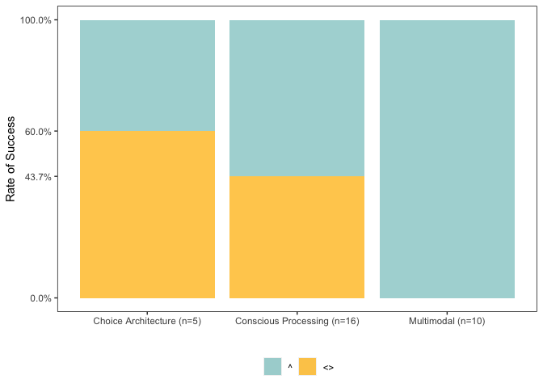
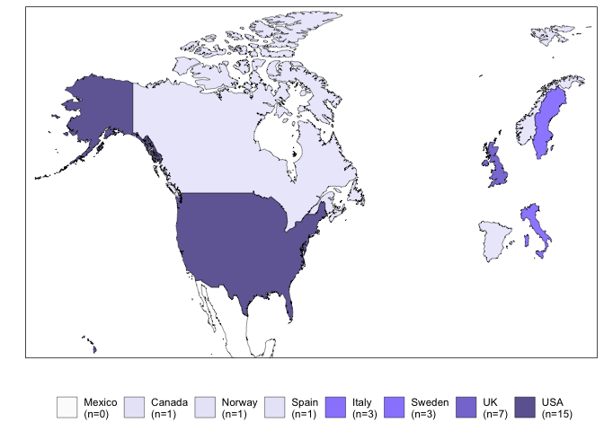

Visuals
================
Last updated: February 13, 2023

## Required Packages

``` r
library(ggplot2)
library(ggsignif)
library(DiagrammeR)
```

## Loading in the Dataset

The dataset used for this project can be found in this project’s
repository under the `data` folder as `sr-dataset.cv`. It can be
imported into your environment using the following code chunk:

``` r
 sr.dataset <- read.csv("~/github/university-meat-reduction/data/sr-dataset.csv")
```

## Reporting on Search Results

grViz(diagram=“digraph flowchart { node
\[fontname=arial,shape=rectangle\] tab1\[label=‘@@1’\]
tab2\[label=‘@@2’\] tab3\[label=‘@@3’\] tab4\[label=‘@@4’\]
tab5\[label=‘@@5’\] tab6\[label=‘@@6’\] tab7\[label=‘@@7’\]
tab8\[label=‘@@8’\] tab9\[label=‘@@9’\] tab1 -\> tab3 -\> tab5 -\> tab6
-\> tab8 -\> tab9; } \[1\]:‘Records identified from databases
(n=13,607):\|ERIC (n=106)\|PsycINFO (n=206)\|PubAg (n=6,900)\|PubMed
(n=1,522)\| Scopus (n=1,567)\|SocAb (n=489)\|Web of Science (n=756)’
\[2\]:‘Duplicates removed (n=2,061)’ \[3\]:‘Records screened (n=11,546)’
\[4\]:‘Records excluded (n=11,460)’ \[5\]:‘Articles retrieved (n=86)’
\[6\]:‘Articles assesses for eligibility (n=86)’ \[7\]:‘Articles
excluded (n=56)’ \[8\]:‘Selected articles (n=29)’ \[9\]:‘Selected
studies (n=31)’”)

## Comparing Success Rates Across the Three Identified Approaches

``` r
ggplot(sr.dataset,aes(x=approach,y=effect.dir,fill=effect.dir))
```

<!-- -->

## Comparing Effect Estimates Across the Three Identified Approaches

``` r
ggplot(sr.dataset)
```

<!-- -->

## Forest Plot

The fixed effect model used for our meta-analysis was restricted to the
17 interventions that utilized observational methods to evaluate changes
in meat consumption.

``` r
ggplot(sr.dataset,aes(x=effect.mag,y=study.title,color=approach)) + 
  geom_errorbar(aes(xmin=lower.ci,xmax=higher.ci),color="black",width=.2,size=.3) +
  geom_point(size=3) + 
  xlab("Estimated Effect Size") + 
  ylab(" ") + 
  scale_x_continuous(breaks=c(0,2,4,6,8),limits=c(0,8)) +
  labs(color="Approach") +
  scale_color_brewer(palette="Set2") +
  scale_y_discrete(limits=c("Garnett et al. (2020a)","Garnett et al. (2021)","Brunner et al. (2018)","Schwitzgebel, Cokelet, & Singer (2020)","Malan (2020)","Larner et al. (2021)","Kurz (2018)","Garnett et al. (2019)","Jalil, Tasoff, & Bustamante (2020)","Turnwald & Crum (2019)","Cerezo-Prieto & Frutos-Esteban (2021)","Piester et al. (2020a)","Piester et al. (2020b)","Slapø & Karevold (2019)","Andersson & Nelander (2021)","Michels et al. (2008)","Garnett et al. (2020b)")) + 
  theme(panel.grid.minor=element_blank())
```

    ## Warning: Removed 14 rows containing missing values (geom_point).

<!-- -->
