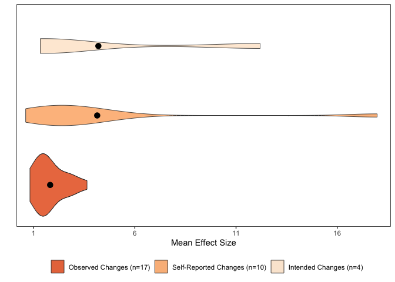

Visuals
================
Last updated: February 13, 2023

## Required Packages

``` r
library(ggplot2)
library(tibble)
library(ggsignif)
library(DiagrammeR)
```

## Loading in the Dataset

The dataset used for this project can be found in this project’s
repository under the `data` folder as `sr-dataset.cv`. It can be
imported into your environment using the following code chunk:

``` r
sr.dataset <- read.csv("~/github/university-meat-reduction/data/sr-dataset.csv")

print(as_tibble(sr.dataset))
```

    ## # A tibble: 31 × 18
    ##    study.title   country year.…¹ year.…² eval.…³ appro…⁴ outco…⁵ effec…⁶ effec…⁷
    ##    <chr>         <chr>     <int>   <int> <chr>   <chr>   <chr>   <chr>     <dbl>
    ##  1 Andersson & … Sweden     2021    2019 Betwee… Multim… Observ… ^          2.78
    ##  2 Brunner et a… Sweden     2018    2016 Pre-Po… Multim… Observ… ^          1.09
    ##  3 Campbell-Arv… USA        2011    2010 Betwee… Multim… Intend… ^         12.2 
    ##  4 Carfora et a… Italy      2019    2018 Both    Consci… Self-R… ^          2.59
    ##  5 Carfora, Cas… Italy      2017    2016 Both    Consci… Self-R… ^          3.49
    ##  6 Carfora, Cas… Italy      2017    2015 Both    Consci… Self-R… ^          3.73
    ##  7 Cerezo-Priet… Spain      2021    2020 Pre-Po… Multim… Observ… ^          1.71
    ##  8 Dissen & Cro… USA        2020    2019 Both    Consci… Self-R… ^          3.2 
    ##  9 Garnett et a… England    2019    2017 Betwee… Choice… Observ… ^          1.52
    ## 10 Garnett et a… England    2020    2017 Betwee… Choice… Observ… <>         0.82
    ## # … with 21 more rows, 9 more variables: lower.ci <dbl>, higher.ci <dbl>,
    ## #   num.strat <int>, inform.mess <int>, financial.inc <int>, menu.pres <int>,
    ## #   area.layout <int>, menu.off <int>, num.study <int>, and abbreviated
    ## #   variable names ¹​year.pub, ²​year.cond, ³​eval.method, ⁴​approach,
    ## #   ⁵​outcome.var, ⁶​effect.dir, ⁷​effect.mag

## Reporting on Search Results

grViz(diagram=“digraph flowchart { node
\[fontname=arial,shape=rectangle\] tab1\[label=‘@@1’\]
tab2\[label=‘@@2’\] tab3\[label=‘@@3’\] tab4\[label=‘@@4’\]
tab5\[label=‘@@5’\] tab6\[label=‘@@6’\] tab7\[label=‘@@7’\]
tab8\[label=‘@@8’\] tab9\[label=‘@@9’\] tab1 -\> tab3 -\> tab5 -\> tab6
-\> tab8 -\> tab9; } \[1\]:‘Records identified from databases
(n=13,607):\|ERIC (n=106)\|PsycINFO (n=206)\|PubAg (n=6,900)\|PubMed
(n=1,522)\| Scopus (n=1,567)\|SocAb (n=489)\|Web of Science (n=756)’
\[2\]:‘Duplicates removed (n=2,061)’ \[3\]:‘Records screened (n=11,546)’
\[4\]:‘Records excluded (n=11,460)’ \[5\]:‘Articles retrieved (n=86)’
\[6\]:‘Articles assesses for eligibility (n=86)’ \[7\]:‘Articles
excluded (n=56)’ \[8\]:‘Selected articles (n=29)’ \[9\]:‘Selected
studies (n=31)’”)

## Comparing Success Rates Across the Three Identified Approaches

``` r
ggplot(sr.dataset,aes(x=approach,y=num.study,fill=effect.dir)) + 
  geom_col(position="fill",alpha=.8) + 
  scale_fill_brewer(palette ="Pastel1") +
  xlab(" ") + 
  ylab("Rate of Success") +
  theme(panel.border=element_rect(fill=NA),panel.background=element_blank())
```

<!-- -->

## Creating a Dataframe for our Fixed Effect Model

``` r
fixed.effect <- filter(sr.dataset,outcome.var=="Observed Changes")
```

``` r
write.csv(fixed.effect,"~/github/university-meat-reduction/data/fixed-effect.csv")
```

``` r
fixed.effect <- read.csv("~/github/university-meat-reduction/data/fixed-effect.csv")

print(as_tibble(fixed.effect))
```

    ## # A tibble: 17 × 18
    ##        X study…¹ country year.…² eval.…³ appro…⁴ outco…⁵ effec…⁶ effec…⁷ lower…⁸
    ##    <int> <chr>   <chr>     <int> <chr>   <chr>   <chr>   <chr>     <dbl>   <dbl>
    ##  1     1 Anders… Sweden     2019 Betwee… Multim… Observ… ^          2.78    1   
    ##  2     2 Brunne… Sweden     2016 Pre-Po… Multim… Observ… ^          1.09    1.01
    ##  3     3 Cerezo… Spain      2020 Pre-Po… Multim… Observ… ^          1.71    1.37
    ##  4     4 Garnet… England    2017 Betwee… Choice… Observ… ^          1.52    1.4 
    ##  5     5 Garnet… England    2017 Betwee… Choice… Observ… <>         0.82    0.78
    ##  6     6 Garnet… England    2018 Betwee… Choice… Observ… ^          3.64    3.51
    ##  7     7 Garnet… England    2018 Pre-Po… Consci… Observ… <>         1.07    1.01
    ##  8     8 Jalil,… USA        2019 Both    Consci… Observ… <>         1.57    0.97
    ##  9     9 Kurz (… Sweden     2015 Both    Choice… Observ… <>         1.44    0.7 
    ## 10    10 Larner… England    2019 Pre-Po… Multim… Observ… ^          1.41    1.36
    ## 11    11 Malan … USA        2019 Both    Multim… Observ… ^          1.39    1.34
    ## 12    12 Michel… USA        2001 Pre-Po… Consci… Observ… ^          2.82    2.57
    ## 13    13 Pieste… USA        2019 Betwee… Multim… Observ… ^          1.87    1.08
    ## 14    14 Pieste… USA        2019 Betwee… Multim… Observ… ^          2.13    1.47
    ## 15    15 Schwit… USA        2017 Both    Consci… Observ… ^          1.27    1.16
    ## 16    16 Slapø … Norway     2018 Pre-Po… Multim… Observ… ^          2.7     1.04
    ## 17    17 Turnwa… USA        2017 Betwee… Choice… Observ… <>         1.68    1.46
    ## # … with 8 more variables: higher.ci <dbl>, num.strat <int>, inform.mess <int>,
    ## #   financial.inc <int>, menu.pres <int>, area.layout <int>, menu.off <int>,
    ## #   num.study <int>, and abbreviated variable names ¹​study.title, ²​year.cond,
    ## #   ³​eval.method, ⁴​approach, ⁵​outcome.var, ⁶​effect.dir, ⁷​effect.mag, ⁸​lower.ci

## Forest Plot

The fixed effect model used for our meta-analysis was restricted to the
17 interventions that utilized observational methods to evaluate changes
in meat consumption.

``` r
ggplot(fixed.effect,aes(x=effect.mag,y=study.title,color=approach)) + 
  geom_errorbar(aes(xmin=lower.ci,xmax=higher.ci),color="black",width=.2,size=.3) +
  geom_point(alpha=.8,size=3) + 
  xlab("Estimated Effect Size") + 
  ylab(" ") + 
  scale_x_continuous(breaks=c(0,2,4,6,8),limits=c(0,8)) +
  labs(color="Approach") +
  scale_color_brewer(breaks=c("Multimodal","Choice Architecture","Conscious Processing"),palette="Set2",labels=c("Multimodal (n=10)","Choice Architecture (n=5)","Conscious Processing (n=16)")) +
  scale_y_discrete(limits=c("Garnett et al. (2020a)","Garnett et al. (2021)","Brunner et al. (2018)","Schwitzgebel, Cokelet, & Singer (2020)","Malan (2020)","Larner et al. (2021)","Kurz (2018)","Garnett et al. (2019)","Jalil, Tasoff, & Bustamante (2020)","Turnwald & Crum (2019)","Cerezo-Prieto & Frutos-Esteban (2021)","Piester et al. (2020a)","Piester et al. (2020b)","Slapø & Karevold (2019)","Andersson & Nelander (2021)","Michels et al. (2008)","Garnett et al. (2020b)")) + 
  theme(panel.background=element_blank(),panel.border=element_rect(fill=NA),panel.grid.minor=element_blank())
```

<!-- -->

## Comparing Effect Estimates Across the Three Identified Approaches

``` r
ggplot(fixed.effect,aes(x=effect.mag,y=approach,fill=approach)) +
  geom_violin(adjust=1.2,alpha=0.8) + 
  stat_summary(fun="mean",geom="point",shape=21,fill="black",size=3) +
  scale_y_discrete(limits=c("Conscious Processing","Choice Architecture","Multimodal")) +
  scale_fill_brewer(palette="Set2",breaks=c("Multimodal","Choice Architecture","Conscious Processing"),labels=c("Multimodal (n=10)","Choice Architecture (n=5)","Conscious Processing (n=16)")) +
  xlab("Odds Ratio") + 
  ylab(" ") +
  labs(fill=" ") +
  theme(panel.border=element_rect(fill=NA),panel.background=element_blank(),axis.ticks.y=element_blank(),axis.text.y=element_blank(),panel.grid.minor=element_blank())
```

<!-- -->
